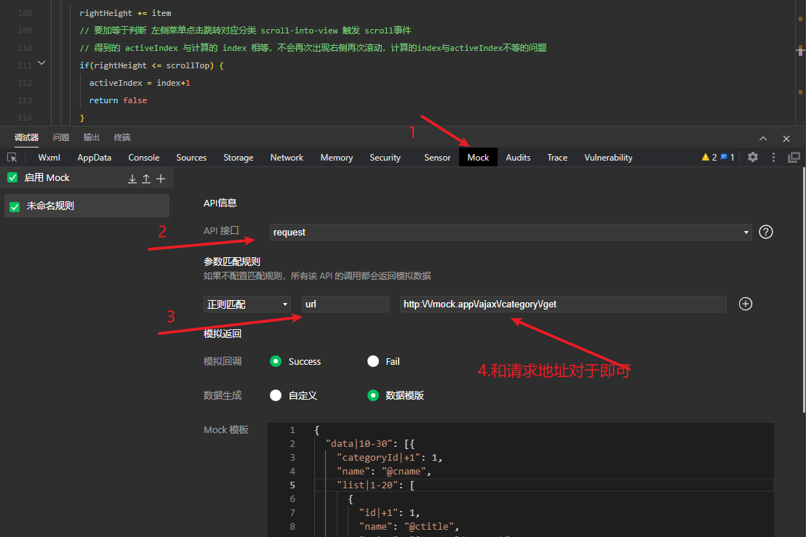

# 说明

小程序左右菜单联动效果

效果图

## 原理

使用 `scroll-view` 组件的 `scroll-top`  和 `scroll-into-view`  属性

左侧分类菜单滚动居中原理：leftScrollTop = 滚动内容的高度 - 可视窗口的高度/2 + 一个分类的高度/2

右侧获取每一项内容块的高度，通过 `scrollTop` 得到当前滚动的距离，用来算出当前处于哪个索引块中，和左侧关联

## 数据mock

数据mock文件在 `utils/mock.js`

配置mock数据

<!--  -->

## 结语

---

> 后续有时间把说明详细补上
